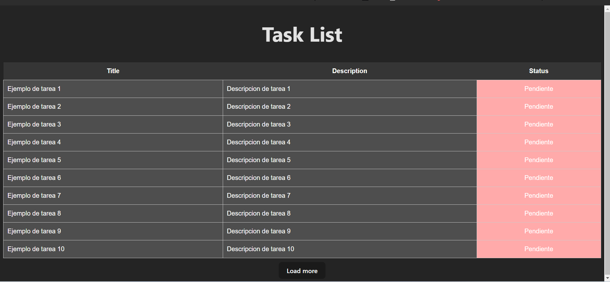

# Check list frontend

Este proyecto tiene como objetivo reflejar las tareas creadas en el backend correspondiente mediante el uso de React, la idea es mostrar brevemente como hacer una pequeña aplicación en React y como trabajar con react-query a un nivel muy inicial además de renderizar componentes paginados.

